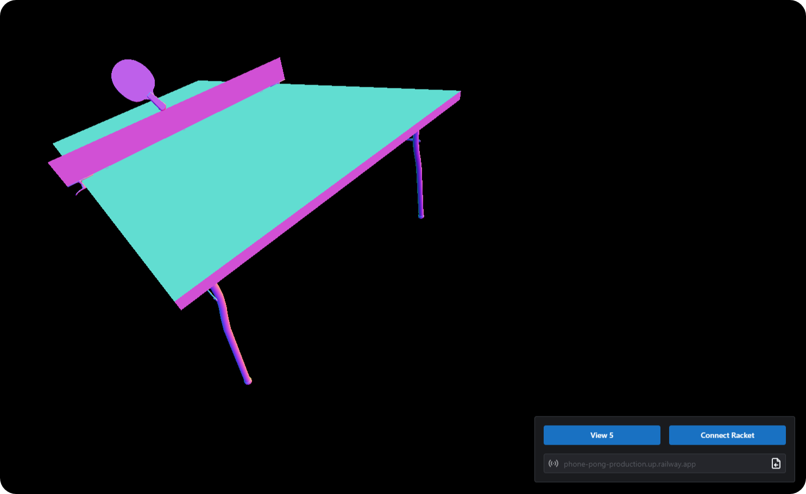

<h2 align="center">
  🏓 phone-pong
   
  Homebrew VR Table Tennis
</h2>

The goal of this project is to make the Virtual Reality experience accessible to anyone with a modern smartphone or sensor-enabled device. Table Tennis is a great target for this concept, as it only really requires tracking the motion of two components; the user's perspective and racket.

## Design

1. Phones or Devices use Websockets to connect to a central server and send updates with their orientation and accerleration meassurements. These are `motion` clients.
2. Phones or Devices that want a view into the Virtual Reality space make another explicit connection to the central server as an `observer`, with information about which `motion` client's perspective from which they wish to view the world.
3. Server handles updates from incoming connections and computes resulting position and rotation of the clients.
4. Server sends out positional and rotational data to every `observer`.
5. Server will additionally compute physics with the environment, including the table and balls, which will also get send to each `observer`

## Goals
- [x] Web client (Javascript)
- [x] Server (Rust) 
- [x] PoC (⚒)
- [ ] Stabilize motion tracking or potentially create system of correction mechanisms (environment image tracking?) 
- [ ] Physics integration (ball + table collisions with racket)
- [ ] Android client
- [ ] iOS client

## References
- [Improving low-cost inertial-measurement-unit (IMU)-based motion tracking accuracy for a biomorphic hyper-redundant snake robot](https://doi.org/10.1186/s40638-017-0069-z)
- [Open source IMU and AHRS algorithms](https://x-io.co.uk/open-source-imu-and-ahrs-algorithms/)